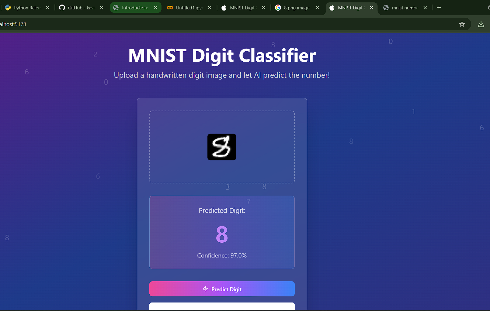

# 🧠 MNIST Digit Classifier Web App

A full-stack web application that classifies handwritten digits using a deep learning model trained on the MNIST dataset.  
Users can upload an image and receive instant predictions through an AI-powered interface.

---

## 🚀 Tech Stack

### ⚙️ Frontend
- **React 18.3.1** — Main UI framework
- **TypeScript** — Type-safe JavaScript
- **Vite 5.4.1 + SWC** — Fast build tool with hot reloading
- **Tailwind CSS 3.4.11** — Utility-first styling
- **shadcn/ui + Radix UI** — Custom components and accessibility primitives
- **Tailwind Animate** — Motion utilities
- **Lucide React** — Icon system
- **React Router DOM** — Routing
- **React Query** — Server-state management
- **React Hook Form + Zod** — Form and schema validation

### 🔌 Backend
- **Python 3.10**
- **Flask** — Lightweight API server
- **TensorFlow / Keras** — Model training and inference
- **Flask-CORS** — Cross-origin requests support
- **Pillow** — Image preprocessing

---

## 🧠 Model Overview

- **Dataset:** [MNIST Handwritten Digits](http://yann.lecun.com/exdb/mnist/)
  - 60,000 training + 10,000 test images (28×28 grayscale)
- **Architecture:**
  - Conv2D → MaxPooling2D → Flatten → Dense (ReLU) → Dense (Softmax)
- **Performance:**
  - ✅ **Accuracy:** ~98% on MNIST test set
- **Export Format:** `model.h5` (Keras-compatible HDF5)

---

## 📦 Project Structure

```
digit-classifier/
├── backend/              # Flask server + trained model
│   ├── app.py
│   ├── model.h5
│   ├── train_model.py
│   └── requirements.txt
├── frontend/             # Vite + React + Tailwind frontend
│   ├── src/
│   ├── public/
│   └── ...
├── README.md
```

---

## 💻 How to Run Locally

### 🔧 Backend (Flask + TensorFlow)

**Requirements:**
- Python **3.10**
- pip
- Virtual environment recommended

```bash
cd backend
python -m venv venv
venv\Scripts\activate  # On Windows
pip install -r requirements.txt
python app.py
```

🟢 Server runs at: `http://localhost:5000`

---

### 🌐 Frontend (React + Vite)

**Requirements:**
- Node.js **v18+**
- npm **v9+**

```bash
cd frontend
npm install
npm run dev
```

🟢 App runs at: `http://localhost:5173`

---

## 🧪 End-to-End Testing Guide

1. Start backend → `python app.py`
2. Start frontend → `npm run dev`
3. Open browser → `http://localhost:5173`
4. Click **“Upload”** → select a digit image (PNG/JPG)
5. Click **“Predict Digit”**
6. See real-time prediction and confidence score 🎯

✔ Works best with clean, centered digit images (28x28 grayscale or any format).

---

## ✅ Deliverables Included

- `train_model.py` → model training & evaluation
- `model.h5` → trained TensorFlow model
- `app.py` → Flask backend with `/predict` endpoint
- React-based frontend → dynamic digit uploader & predictor UI
- `README.md` → setup + testing + architecture summary

---

## 👤 Author & Project Links

- **Author:** Aarav Singla  
- **GitHub Profile:** [https://github.com/aaravsingla](https://github.com/aaravsingla)  
- **Project Source Code:** [https://github.com/aaravsingla/Digit-classifier](https://github.com/aaravsingla/Digit-classifier)  
- **Email:** aarav.singla@research.iiit.ac.in
